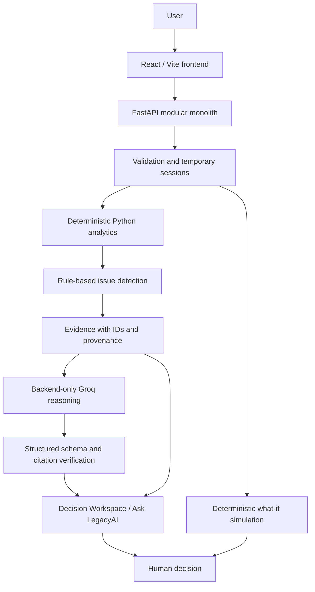

# LegacyAI

**From business data to evidence-backed decisions.**

[Live Demo](https://legacy-ai-mu.vercel.app) · [GitHub](https://github.com/akanshu-09/LegacyAI) · [Backend Health](https://legacyai-api.onrender.com/health)

## Project Overview

**Problem statement: AI Decision Engine for Business Data.** Sales and inventory reports describe what happened; deciding what to investigate or change requires traceable facts. LegacyAI validates business data, computes metrics in Python, detects operational issues, and supplies their evidence to AI reasoning. Users inspect that evidence and test hypothetical actions before making a decision.

Unlike a CSV chatbot, the model does not compute authoritative metrics from raw rows. Unlike a dashboard alone, LegacyAI connects observed issues to reasoning, assumptions and simulation.

**AI reasons about verified data — it does not replace the data.**

```text
Business Data → Validation → Deterministic Analytics → Issue Detection
→ Verified Evidence → AI Reasoning → Claim Verification
→ Recommended Decision → What-If Simulation → Human Decision
```

Simulation is also available independently; recommendations never execute actions.

## Key Features

- **Trusted ingestion:** UTF-8 CSV upload with explicit validation, or a built-in synthetic demo.
- **Deterministic analytics:** revenue, units sold, latest inventory, daily/product/category summaries and supported period comparisons.
- **Rule-based detection:** demand decline, demand spike, stockout risk, excess inventory and sales anomalies, with documented thresholds and unsupported evaluations.
- **Evidence/provenance:** values, source, method, observation periods, exact ratios and expandable evidence IDs.
- **AI Decision Engine / Decision Workspace:** structured Groq reasoning over selected evidence, recommendations, assumptions, uncertainty and citation verification status.
- **Ask LegacyAI:** supported questions compile to deterministic findings with evidence; unsupported requests abstain.
- **What-If Simulator:** separate baseline/scenario results for assumed receipts and demand over 7, 14 or 30 days. Python calculates; the browser displays.
- **Failure handling:** provider errors leave deterministic evidence available; cancelled/stale Decision requests cannot overwrite the selected result.

The demo yields three inventory issues. Synthetic test fixtures exercise all five detector families.

## Architecture



Groq receives selected evidence, not uploaded raw rows. Pydantic validates the response shape and independent Python verification checks its citations. Simulation uses no LLM. Backend modules share one process and bounded memory, without a database.

## Technology Stack

| Layer | Technology | Purpose |
| --- | --- | --- |
| Frontend | React 19, Vite 7, CSS | Dashboard and workflow presentation |
| Backend | Python, FastAPI, Uvicorn | API and temporary sessions |
| Analytics | Standard-library CSV, Decimal, Fraction | Validation, monetary arithmetic and exact unit calculations |
| Validation / schemas | Pydantic | Structured AI and simulation contracts |
| AI | Groq API, `openai/gpt-oss-120b` default, HTTPX | Backend reasoning transport |
| Configuration | python-dotenv, Vite environment variables | Private backend/public frontend configuration |
| Testing | pytest, TestClient/HTTPX, Node test runner | API/numerical checks and cancellation regression tests |
| Deployment | Vercel frontend, Render backend | Split HTTPS hosting |

**Pandas is not used or required** by the current implementation.

## Dataset Contract

Required CSV headers:

```csv
date,product_id,product_name,category,units_sold,revenue,inventory,unit_price
```

Optional headers: `supplier`, `lead_time_days`. Headers must match exactly; unknown/duplicate columns are rejected. Dates use `YYYY-MM-DD`; units/inventory are nonnegative integers; revenue/unit price are nonnegative monetary values. Required blanks, duplicate rows and conflicting product/date observations are rejected. Optional blanks remain null. Limits: **2 MiB / 10,000 data rows**.

`unit_price` is a **selling price, not cost**. Revenue uses supplied revenue, never units × price. Inventory uses each product's latest snapshot once, never a sum across dates. No currency identifier or cost data is available: profit, margin, ROI and savings cannot be derived.

Use **Load Demo Business** without a CSV: 540 synthetic observations, six products, three categories. See the [data contract](docs/DATA_CONTRACT.md), [metric formulas](docs/METRICS.md) and [detector rules](docs/DETECTORS.md).

## Getting Started

Prerequisites: Git, Node.js **22.12+** with npm, and Python **3.12** (tested with 3.12.14). Use two terminals. A Groq key is needed for live AI reasoning; deterministic features work without one.

### 1. Clone

```sh
git clone https://github.com/akanshu-09/LegacyAI.git
cd LegacyAI
```

### 2. Backend Setup

Windows PowerShell, from the repository root:

```powershell
cd backend
python -m venv .venv
.\.venv\Scripts\Activate.ps1
python -m pip install -r requirements-dev.txt
Copy-Item .env.example .env
```

macOS/Linux, from the repository root:

```sh
cd backend
python3 -m venv .venv
source .venv/bin/activate
python -m pip install -r requirements-dev.txt
cp .env.example .env
```

Set `backend/.env` to the following, replacing the key placeholder:

```dotenv
CORS_ORIGINS=http://localhost:5173
LLM_PROVIDER=groq
LLM_MODEL=openai/gpt-oss-120b
GROQ_API_KEY=your_groq_api_key
```

The backend example contains CORS only; add the AI settings yourself. Omit the key for deterministic-only evaluation. Optional `LLM_PROVIDER=mock` enables synthetic test reasoning, not live Groq. Provider/model defaults otherwise match the values above.

Start from `backend/` with the environment active:

```sh
python -m uvicorn app.main:app --reload --host 127.0.0.1 --port 8000
```

If PowerShell activation is unavailable, substitute `.\.venv\Scripts\python.exe` for `python`; activation is not required. Development requirements include production dependencies plus pytest. Production installs use `requirements.txt`, which includes HTTPX.

The backend loads `.env` by path; process environment variables take precedence. `CORS_ORIGINS` accepts comma-separated exact origins without trailing slashes. Opening the frontend on 127.0.0.1 requires adding that exact origin.

### 3. Frontend Setup

Second terminal, from the repository root:

```sh
cd frontend
npm ci
```

Copy `.env.example` to `.env`: PowerShell `Copy-Item .env.example .env`, or macOS/Linux `cp .env.example .env`. Set:

```dotenv
VITE_API_BASE_URL=http://127.0.0.1:8000
```

```sh
npm run dev
```

`npm ci` installs the committed lockfile reproducibly. The example defaults to localhost:8000; either backend hostname works with the binding above. Restart Vite after configuration changes. `VITE_API_BASE_URL` is public and embedded at build time: **never put a Groq key in any `VITE_*` variable**.

### 4. Run the Application

1. Start backend, then frontend.
2. Open [http://localhost:5173](http://localhost:5173).
3. Expand **Connection status** to confirm **Backend connected**.
4. Open **Data → Load Demo Business**.

Local backend: [health](http://127.0.0.1:8000/health), [interactive API docs](http://127.0.0.1:8000/docs). For connectivity failures, check both servers, the API URL and exact browser origin in CORS, then retry.

## Quick Judge Demo

1. Open the [live application](https://legacy-ai-mu.vercel.app), then **Data → Load Demo Business**.
2. Return to **Overview** for the business snapshot and issues to investigate.
3. Open **Insights** and inspect Harbor Pen Set's stockout evidence, including zero observed inventory.
4. Select **Investigate & Decide** to review reasoning, citations and uncertainty.
5. In **Ask AI**, ask “What are our top inventory risks?” Try an unsupported profit question to see abstention.
6. Open **Simulator**, select a product, enter your own baseline receipt quantity and compare hypothetical adjustments over a chosen horizon.

If the backend is waking up, retry connection status. If Groq is unavailable, inspect deterministic evidence; simulation remains independent of AI.

## API Overview

`{analysis_id}` is the opaque session ID returned by upload/demo creation.

| Method | Route | Purpose |
| --- | --- | --- |
| GET | `/health` | Process health, independent of Groq |
| POST | `/api/v1/analysis/upload` | Raw CSV body (`Content-Type: text/csv`); returns 201 |
| POST | `/api/v1/analysis/demo` | Create synthetic demo session; returns 201 |
| GET | `/api/v1/analysis/{analysis_id}` | Dataset profile and expiry |
| GET | `/api/v1/analysis/{analysis_id}/analytics` | Deterministic metrics |
| GET | `/api/v1/analysis/{analysis_id}/issues` | Issues, evidence and evaluations |
| POST | `/api/v1/analysis/{analysis_id}/decisions/{issue_id}` | Structured decision reasoning |
| POST | `/api/v1/analysis/{analysis_id}/ask` | Business question (`{"question":"…"}`) |
| GET | `/api/v1/analysis/{analysis_id}/simulation` | Product eligibility and source inputs |
| POST | `/api/v1/analysis/{analysis_id}/simulate` | Baseline/scenario calculation |
| DELETE | `/api/v1/analysis/{analysis_id}` | Release session; returns 204 |

Upload uses raw CSV, not multipart. Unknown/expired/released sessions return 404. See [simulation inputs](docs/SIMULATION.md) and [AI contracts](docs/AI_CONTRACT.md).

## Reliability / Design Principles

- Python facts precede AI reasoning. Decimal money and exact unit ratios preserve precision until documented display boundaries.
- Dataset dates define comparisons, not the system clock. Incomplete coverage abstains.
- Evidence IDs connect values to source, method and exact inputs.
- Pydantic constrains AI response shape. Independent verification checks cited IDs against the selected evidence; missing/unknown citations lead to rejection or partial verification. This is **citation validation, not proof that every natural-language claim is correct**.
- Assumptions/uncertainty remain visible. Unsupported questions abstain; provider errors do not disable deterministic workflows.
- Only the analysis ID persists in tab-scoped browser sessionStorage; normalized rows remain in backend memory.

## Testing

From `backend/`, with the virtual environment active:

```sh
python -m pytest
```

From `frontend/`:

```sh
npm test
npm run build
npm audit
```

Verified locally on **2026-10-03**: **327 backend tests passed, 1 optional live Groq smoke test skipped; 6 frontend tests passed; production build passed; npm audit: 0 vulnerabilities.** Tests ran with the Groq key blanked in the test process, preventing optional live calls. One upstream Starlette/HTTPX TestClient deprecation warning remains. These are local results, not complete hosted end-to-end validation.

Optional `npm run preview` serves localhost:4173. Add `http://localhost:4173` to backend CORS and restart the backend for preview API access.

## Deployment

| Component | Host | URL |
| --- | --- | --- |
| Frontend | Vercel | https://legacy-ai-mu.vercel.app |
| Backend | Render | https://legacyai-api.onrender.com |

Vercel: root `frontend/`, framework Vite, install `npm ci`, build `npm run build`, output `dist`, public `VITE_API_BASE_URL=https://legacyai-api.onrender.com`. `frontend/vercel.json` enables SPA deep links, including `/decisions/:issueId`.

Render: leave Root Directory blank (repository root), build `pip install -r backend/requirements.txt`, start `uvicorn app.main:app --host 0.0.0.0 --port $PORT`, health path `/health`. Set `PYTHONPATH=backend`, `PYTHON_VERSION=3.12.14`, `WEB_CONCURRENCY=1`, `CORS_ORIGINS=https://legacy-ai-mu.vercel.app`, `LLM_PROVIDER=groq`, `LLM_MODEL=openai/gpt-oss-120b`, and private `GROQ_API_KEY`. Repository-root access preserves `data/demo_business.csv`; Render supplies PORT. Keep one worker and one instance for process-local sessions.

Secrets stay backend-only. API URL changes require a frontend rebuild; CORS changes require a backend restart/redeployment. Real `.env`, virtual environments, dependencies and build output are ignored by Git.

## Repository Structure

```text
LegacyAI/
├── backend/
│   ├── app/          # validation, sessions, analytics, detectors, evidence,
│   │                 # reasoning, verification, ask, schemas, simulation
│   ├── tests/        # API, numerical and adversarial regression fixtures
│   └── requirements.txt
├── frontend/
│   ├── src/          # pages, shared presentation and API client
│   ├── tests/        # request cancellation regression tests
│   └── vercel.json   # SPA routing
├── data/             # deterministic synthetic demo CSV
├── docs/             # contracts, formulas and validation reports
├── AGENTS.md         # engineering rules
├── ROADMAP.md
└── README.md
```

## Limitations / Scope

This hackathon MVP uses **temporary in-memory sessions**, not persistent storage. Sessions expire after 30 absolute minutes; restart/redeployment clears them. Retained data is bounded to 20 sessions and 64 MiB. No database, authentication or cross-process session sharing is implemented.

Simulation assumes constant demand and immediate hypothetical receipt. It is **not a forecasting model** or purchasing instruction. Cost, profit and supplier capacity are not modeled. Recommendations support human decisions and never execute autonomous purchasing. Citation verification does not establish causal truth or guarantee all prose is numerically grounded.

## AI Tools / AI Usage

The application uses Groq-hosted reasoning over deterministic evidence, structured responses and independent citation checks. Development and documentation used AI-assisted coding with OpenAI Codex. AI-generated metrics and confidence scores are not treated as business facts.

Further reading: [architecture](docs/ARCHITECTURE.md), [data contract](docs/DATA_CONTRACT.md), [metrics](docs/METRICS.md), [detectors](docs/DETECTORS.md), [AI contract](docs/AI_CONTRACT.md), [simulation](docs/SIMULATION.md).
